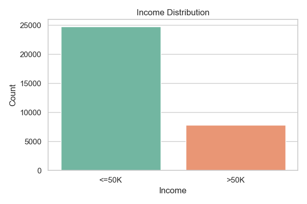
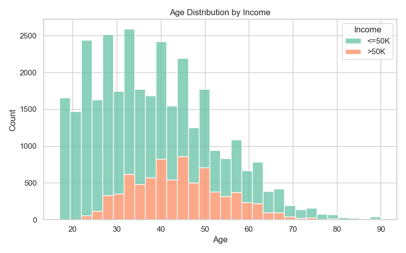
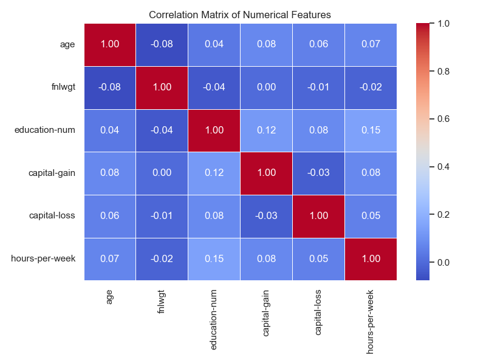
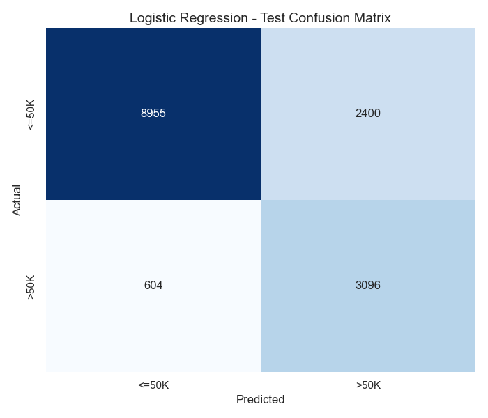
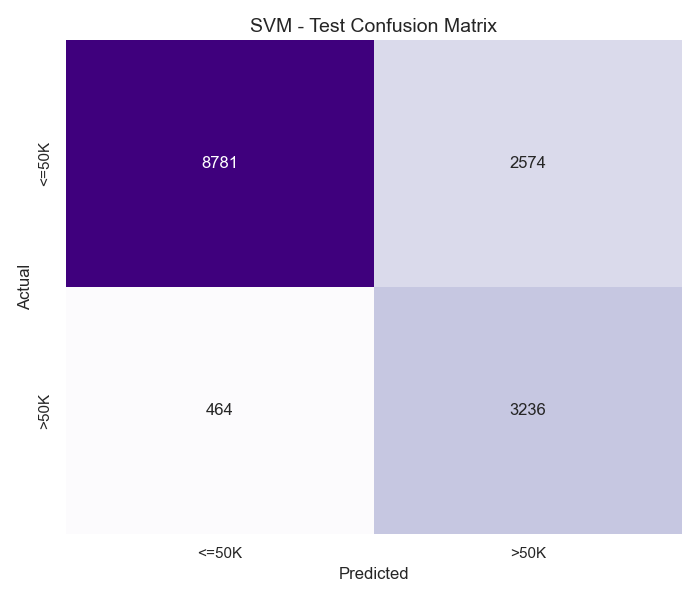
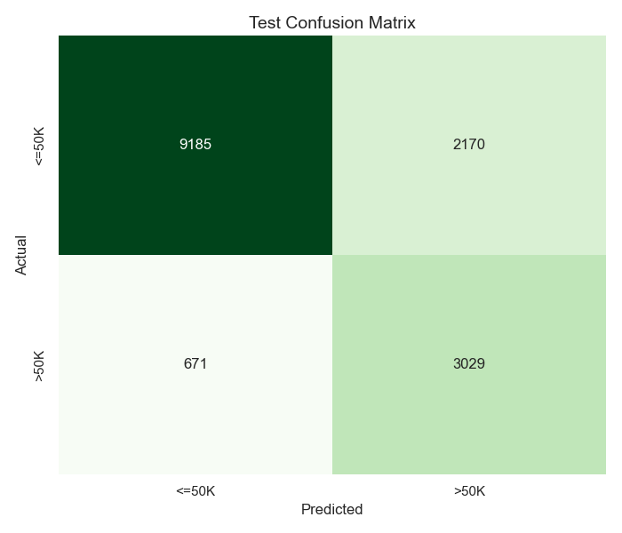
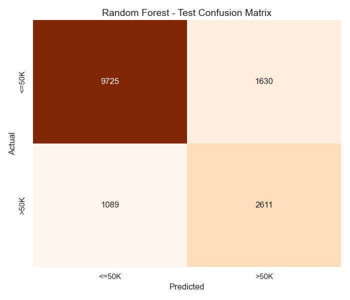
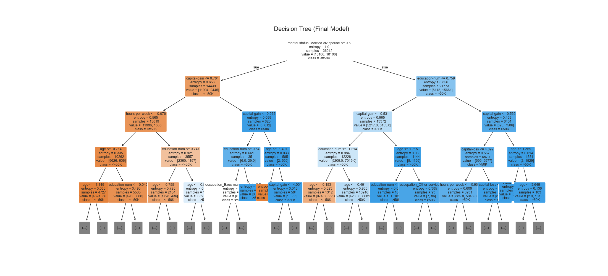

# 💰 Income Classification — Income Prediction

> A complete machine learning pipeline that predicts whether a person's annual income exceeds **$50K** based on U.S. Census data. Built with **scikit-learn**, featuring four classification models, hyperparameter tuning, and rich EDA visualizations.


---

## 📋 Table of Contents

- [Overview](#-overview)
- [Dataset](#-dataset)
- [Pipeline](#-pipeline)
- [Models & Results](#-models--results)
- [Visualizations](#-visualizations)
- [Project Structure](#-project-structure)
- [Getting Started](#-getting-started)
- [License](#-license)

---

## 🔍 Overview

This project tackles the classic **binary classification** problem from the [UCI Adult Census Income](https://archive.ics.uci.edu/dataset/2/adult) dataset. The goal is to predict whether an individual earns **≤50K** or **>50K** per year using demographic and employment features.

### Key Highlights

- **End-to-end pipeline** — from raw data exploration to tuned model evaluation
- **4 ML algorithms** compared head-to-head with consistent evaluation
- **SMOTE** oversampling to handle class imbalance (~75% / 25% split)
- **GridSearchCV** hyperparameter tuning for all models
- **Rich visualizations** generated at every stage of the pipeline

---

## 📊 Dataset

| Property | Details |
|----------|---------|
| **Source** | [UCI Machine Learning Repository — Adult](https://archive.ics.uci.edu/dataset/2/adult) |
| **Train Samples** | ~32,561 |
| **Test Samples** | ~16,281 |
| **Features** | 14 (6 numerical, 8 categorical) |
| **Target** | `Income` — binary (`<=50K` or `>50K`) |

### Features

| Feature | Type | Description |
|---------|------|-------------|
| `age` | Numerical | Age of the individual |
| `workclass` | Categorical | Employment type (Private, Gov, Self-emp, etc.) |
| `fnlwgt` | Numerical | Census weighting factor |
| `education` | Categorical | Highest education level |
| `education-num` | Numerical | Education level (numeric) |
| `marital-status` | Categorical | Marital status |
| `occupation` | Categorical | Job type |
| `relationship` | Categorical | Family relationship |
| `race` | Categorical | Race |
| `sex` | Categorical | Gender |
| `capital-gain` | Numerical | Capital gains |
| `capital-loss` | Numerical | Capital losses |
| `hours-per-week` | Numerical | Weekly working hours |
| `native-country` | Categorical | Country of origin |

---

## ⚙️ Pipeline

The project follows a structured ML workflow:

```
1. Data Loading
   └── Load train & test CSV files

2. Exploratory Data Analysis (EDA)
   ├── Target distribution
   ├── Age distribution by income
   └── Correlation matrix heatmap

3. Preprocessing
   ├── Strip whitespace & replace '?' with NaN
   ├── Drop missing values & duplicates
   ├── One-hot encode categorical features
   ├── Correlation-based feature selection (threshold > 0.1)
   ├── StandardScaler on numerical features
   └── SMOTE oversampling (train set only)

4. Model Training & Evaluation
   ├── Logistic Regression
   ├── Support Vector Machine (SVM)
   ├── Decision Tree
   └── Random Forest

5. Hyperparameter Tuning
   └── GridSearchCV for all 4 models

6. Final Comparison
   └── Best model accuracy on unseen test set
```

---

## 🏆 Models & Results

All models were evaluated on the **held-out test set** after hyperparameter tuning via GridSearchCV:

| Model | Tuned Test Accuracy | Tuning Parameters |
|-------|:-------------------:|-------------------|
| **Logistic Regression** | ~82% | `C`: [0.01, 0.1, 1, 10], `solver`: [liblinear, lbfgs] |
| **SVM (RBF kernel)** | ~82% | `C`: [0.1, 1, 10], `kernel`: [linear, rbf] |
| **Decision Tree** | ~82% | `max_depth`: [5, 10, 15, None], `min_samples_split`: [2, 10, 20] |
| **Random Forest** | ~82% | `n_estimators`: [50, 100, 200], `max_depth`: [10, 20, None] |

> **Note:** Run `main.py` to get exact accuracy numbers on your machine. Results may vary slightly depending on environment.

---

## 📈 Visualizations

The pipeline generates visualizations at every stage, saved to the `Visuals/` directory.

### Before Preprocessing

| Income Distribution | Age Distribution by Income | Correlation Matrix |
|:-------------------:|:--------------------------:|:------------------:|
|  |  |  |

### Model Evaluation — Confusion Matrices

| Logistic Regression | SVM | Decision Tree | Random Forest |
|:-------------------:|:---:|:-------------:|:-------------:|
|  |  |  |  |

### Decision Tree Structure



---

## 📁 Project Structure

```
INCOME/
├── main.py                  # Full ML pipeline (run this)
├── train_data.csv           # Raw training dataset
├── test_data.csv            # Raw test dataset
├── train_data_clean.csv     # Preprocessed training data (generated)
├── test_data_clean.csv      # Preprocessed test data (generated)
├── requirements.txt         # Python dependencies
├── Visuals/                 # All generated plots
│   ├── before_train/        # EDA plots (raw train data)
│   ├── before_test/         # EDA plots (raw test data)
│   ├── after_train/         # EDA plots (preprocessed train data)
│   ├── after_test/          # EDA plots (preprocessed test data)
│   ├── lr_confusion_matrix.png
│   ├── svm_confusion_matrix.png
│   ├── dt_confusion_matrix.png
│   ├── rf_confusion_matrix.png
│   └── decision_tree_final.png
├── .gitignore
├── LICENSE
└── README.md
```

---

## 🚀 Getting Started

### Prerequisites

- Python **3.8** or higher
- pip

### Installation

1. **Clone the repository**
   ```bash
   git clone https://github.com/<your-username>/income-classification.git
   cd income-classification
   ```

2. **Create a virtual environment** (recommended)
   ```bash
   python -m venv venv

   # Windows
   venv\Scripts\activate

   # macOS / Linux
   source venv/bin/activate
   ```

3. **Install dependencies**
   ```bash
   pip install -r requirements.txt
   ```

4. **Run the pipeline**
   ```bash
   python main.py
   ```

   This will:
   - Display dataset statistics
   - Generate EDA visualizations
   - Preprocess the data
   - Train all 4 models
   - Run hyperparameter tuning
   - Print final accuracy comparison

> ⏱️ **Note:** SVM training and hyperparameter tuning can take several minutes depending on your hardware.

---

## 📜 License

This project is licensed under the **MIT License** — see the [LICENSE](LICENSE) file for details.

---

<p align="center">
  <b>Built with ❤️ for learning and exploration</b>
</p>
